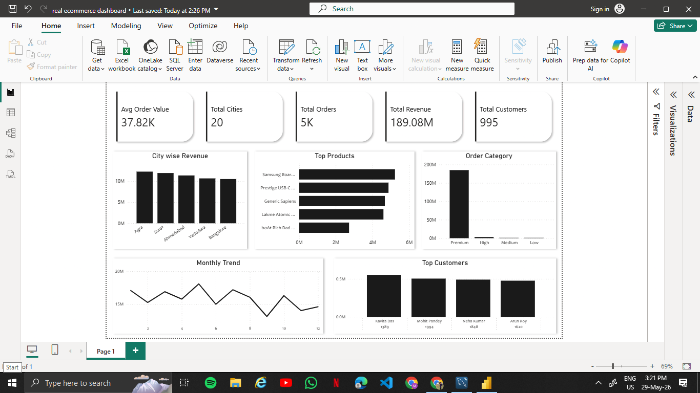

# 🛒 Ecommerce Sales Analysis — SQL + Power BI

## 📌 Project Overview
End-to-end data analysis project on a real ecommerce dataset.
Raw data was analyzed using **MySQL** and visualized using **Power BI**.

---

## 🗃️ Dataset
| Table | Rows | Description |
|---|---|---|
| customers | 1,000 | Customer details |
| products | 70 | Product catalog |
| orders | 5,000 | Order transactions |
| order_items | 12,644 | Order line items |

---

## 🔧 Tools Used
- **MySQL** — Data storage & analysis
- **Power BI** — Dashboard & visualization
- **Excel** — Data export

---

## 📊 Analysis Performed (17 Sections)
- ✅ Data Overview & NULL Check
- ✅ Overall Business Performance
- ✅ City wise Orders & Revenue
- ✅ Category wise Product Analysis
- ✅ Top 10 Best Selling Products
- ✅ Top 10 Customers by Spending
- ✅ Monthly Revenue Trend
- ✅ Order Category Breakdown (Premium / High / Medium / Low)
- ✅ Products that were Never Sold

---

## 📈 Power BI Dashboard
- KPI Cards — Total Revenue, Orders, Customers, Avg Order Value
- City wise Revenue — Bar Chart
- Monthly Trend — Line Chart
- Order Category — Pie Chart
- Top Products & Customers — Bar Charts

---

## 📁 Project Structure
```
sql practice/
├── result/                     # 6 analysis CSV files
├── customers data.csv          # Raw customer data
├── orders data.csv             # Raw orders data
├── products data.csv           # Raw products data
├── order_item data.csv         # Raw order items data
├── real ecommerce dashboard    # Power BI file (.pbix)
├── sql query.sql               # All 17 SQL queries
└── Screenshot.png              # Dashboard preview
```

---

## 🚀 How to Run
1. Import 4 CSV files into MySQL
2. Run `sql query.sql` for complete analysis
3. Open `real ecommerce dashboard.pbix` in Power BI

---

## 💡 Key Insights
- Total Revenue: **189M+**
- Total Orders: **5,000**
- Unique Customers: **995**
- Top City by Revenue: **Agra**
- Best Selling Category: **Electronics**

---

## 📸 Dashboard Preview


---

## 👤 Author
**krishna srivastava**  
Aspiring Data Analyst  
